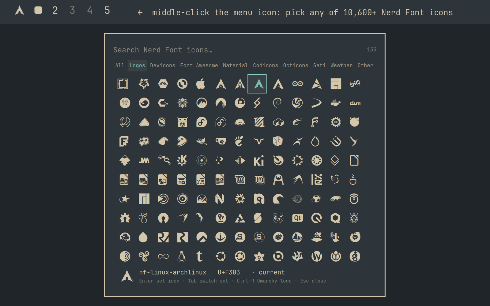

# Nerd Menu Icon

An Omarchy bar widget that works exactly like the stock menu button, but shows
any [Nerd Font](https://www.nerdfonts.com/cheat-sheet) icon you pick in place of
the Omarchy logo. You pick the icon from a searchable grid of all 10,600+
glyphs.



- **Left click**: Omarchy menu
- **Right click**: terminal
- **Middle click**: icon picker

## Who this is for

[Omarchy](https://omarchy.org) users on the Quickshell bar (Omarchy 4+) who want
a different menu icon than the logo: a distro logo, a favourite glyph, anything
from the Nerd Fonts set. No extra packages are needed, because Omarchy already
ships a Nerd Font.

## What it changes

Everything happens in your own config, nothing runs as root, and every step can
be undone (see [Remove](#remove)):

- The install steps put this widget in the bar's left section and disable the
  stock `omarchy.menu` button, which keeps its files and can be re-enabled.
- Picking an icon writes the `glyph` and `font` settings on this widget's entry
  in `~/.config/omarchy/shell.json`, through Omarchy's own settings call.
- The optional menu entry below is a line you add to your own
  `~/.config/omarchy/extensions/omarchy-menu.jsonc`.

## The picker

Type to search by Nerd Fonts class name (`arch`, `nf-md-ghost`, `linux tux`)
or by code point (`f303`, `U+F303`). Every word you type must match.

| Key | Action |
|---|---|
| Arrows, PgUp/PgDn, Ctrl+Home/End | Move |
| Enter or click | Set as the menu icon |
| Tab / Shift+Tab | Switch icon set (Logos, Devicons, Font Awesome, Material, …) |
| Ctrl+R | Back to the Omarchy logo |
| Backspace, Ctrl+Backspace, Ctrl+U | Edit the search |
| Esc | Clear the search, then close |

Your current icon has an outline around it, and the footer shows the highlighted
icon's name and code point.

You can also open the picker from a script or a key binding:

```bash
omarchy-shell shell toggle nzkritik.nerd-menu
```

### From the Omarchy menu

To get a **Style › Menu Bar › Menu Icon** entry, add this line inside the braces
of `~/.config/omarchy/extensions/omarchy-menu.jsonc`. The `when` condition hides
the entry whenever the widget isn't on the bar:

```jsonc
"style.bar.icon": {"icon":"󰀻","label":"Menu Icon","aliases":["menu-icon"],"description":"Pick a Nerd Font icon for the menu button","action":"omarchy-shell shell toggle nzkritik.nerd-menu","when":"jq -e 'any(.bar.layout[][]?; .id == \"nzkritik.nerd-menu\")' \"$HOME/.config/omarchy/shell.json\" >/dev/null"},
```

## Install

```bash
omarchy plugin add https://github.com/nzkritik/omarchy-nerd-menu --enable
omarchy bar put nzkritik.nerd-menu --section left --index 0
omarchy plugin disable omarchy.menu    # hide the stock button
```

## Set an icon without the picker

The widget reads two settings from its entry in `~/.config/omarchy/shell.json`:

```bash
omarchy bar set nzkritik.nerd-menu glyph f303    # nf-linux-archlinux
omarchy bar set nzkritik.nerd-menu font ""       # empty = the bar font
```

An empty `glyph` shows the Omarchy logo. Omarchy's bar fonts are Nerd Fonts,
so `font` only needs setting to draw the icon from some other family.

## Remove

```bash
omarchy plugin enable omarchy.menu
omarchy bar put omarchy.menu --section left --index 0
omarchy plugin disable nzkritik.nerd-menu
omarchy plugin remove nzkritik.nerd-menu
```

## Updating the icon list

`Glyphs.js` is generated from the installed Symbols Nerd Font, whose glyph
names are the Nerd Fonts class names. Regenerate it after a Nerd Fonts release
(needs `python-fonttools` and `ttf-nerd-fonts-symbols`):

```bash
tools/gen-glyphs.py
```

## License

MIT. The glyph names and code points come from
[Nerd Fonts](https://github.com/ryanoasis/nerd-fonts), also MIT.
